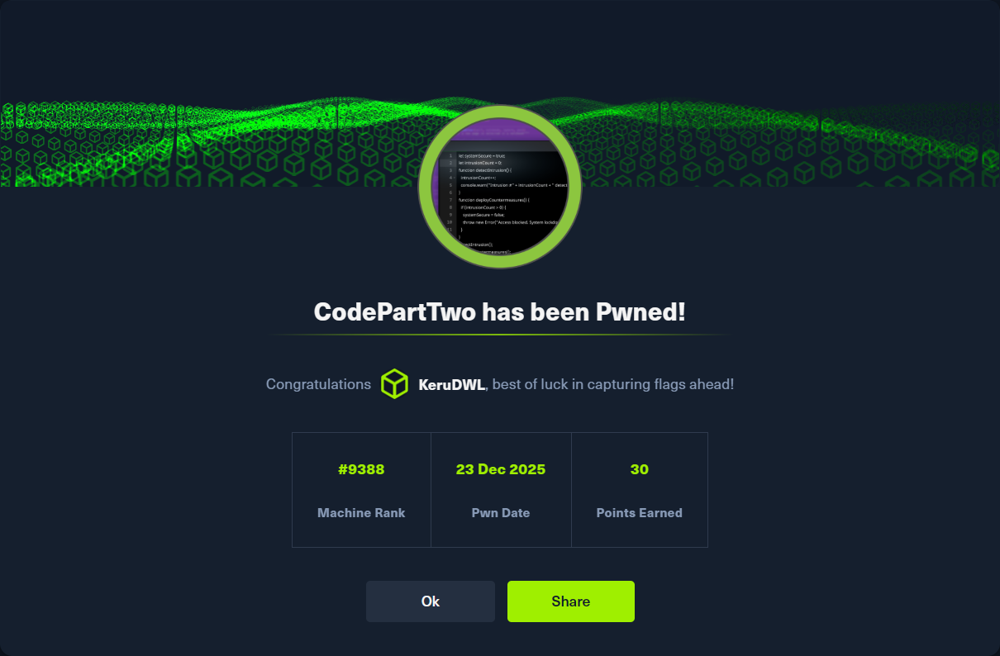

<h1 align="center">Reporte Técnico de Pentesting – HTB CodePartTwo</h1>

  

Este repositorio contiene un reporte técnico completo de pruebas de penetración
realizadas sobre la máquina **CodePartTwo** de la plataforma **Hack The Box**.

## Contenido
- Reconocimiento y enumeración
- Análisis de vulnerabilidades
- Explotación (CVE-2024-28397)
- Post-explotación
- Escalamiento de privilegios
- Captura de flags (user / root)

## Técnicas utilizadas
- Web Enumeration (ffuf)
- Remote Code Execution (js2py)
- Password cracking (MD5)
- Privilege escalation (sudo misconfiguration)

## Reporte
**[Reporte completo en PDF](Reporte_HTB_CodePartTwo.pdf)**

## Exploit
El exploit desarrollado y utilizado durante la fase de explotación se encuentra
disponible en el siguiente archivo:

**[exploit.py](./Exploits/exploit.py)**

## Aviso
Este contenido tiene fines **educativos** y fue desarrollado en un entorno
controlado (Hack The Box). No debe utilizarse contra sistemas sin autorización.

## Autor
**KeruDWL**  
2025
