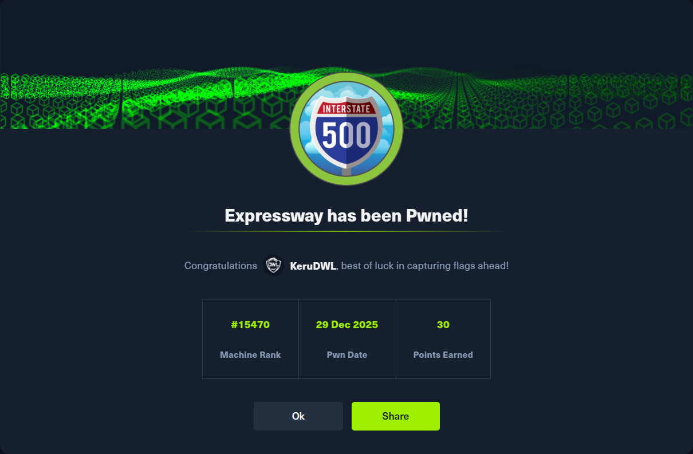

<h1 align="center">Reporte Técnico de Pentesting – HTB Expressway</h1>

  

Este repositorio contiene un reporte técnico completo de pruebas de penetración
realizadas sobre la máquina **Expressway** de la plataforma **Hack The Box**.

## Contenido
- Reconocimiento y enumeración (TCP / UDP)
- Análisis de servicios de infraestructura (VPN / IKE)
- Explotación (IKE Aggressive Mode + PSK Capture)
- Crackeo de credenciales (Offline Dictionary Attack)
- Acceso inicial (SSH)
- Enumeración local y búsqueda de SUIDs
- Escalamiento de privilegios (Abuso de binario SUID personalizado)
- Captura de flags (user / root)

## Técnicas utilizadas
- Network reconnaissance (ICMP, Nmap, **UDP Scanning**)
- VPN Enumeration (ike-scan)
- Cryptographic failures abuse (IKE Aggressive Mode)
- Offline Password Cracking (psk-crack + rockyou.txt)
- Remote access (SSH)
- SUID Binary Abuse (Path/Configuration exploitation)
- Privilege Escalation (Misconfigured `/usr/local/bin/sudo`)

## Reporte
**[Reporte completo en PDF](Reporte_HTB_Expressway.pdf)**

## Aviso
Este contenido tiene fines **educativos** y fue desarrollado en un entorno
controlado (Hack The Box). No debe utilizarse contra sistemas sin autorización.

## Autor
**KeruDWL** 2026
